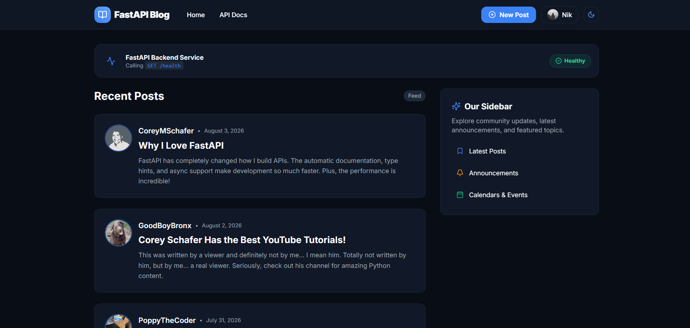

# FastAPI Blog Monorepo (Next.js + FastAPI + Turborepo)

A modern, high-performance full-stack blog application built with a **Turborepo** monorepo architecture:
- **Frontend (`apps/web`)**: Next.js 15 (App Router), TypeScript, Tailwind CSS, shadcn UI styling patterns, Axios API client with `NEXT_PUBLIC_API_URL` proxy helper, dark/light theme switching, and animated skeleton loaders.
- **Backend (`apps/api`)**: Preserved FastAPI backend (Python + `uv`), PostgreSQL database (SQLAlchemy async + Alembic migrations), Cloudflare R2 media storage (via `boto3` / Pillow), JWT authentication, and automated `pytest` test suite.

---

## 📸 Screenshots



---

## 📁 Repository Structure

```
repo/
├── apps/
│   ├── api/                     # FastAPI Python Backend
│   │   ├── alembic/             # Database migration scripts
│   │   ├── alembic.ini
│   │   ├── media/               # Media uploads directory
│   │   ├── static/              # Static files (default avatars, etc.)
│   │   ├── routers/             # API routers (users.py, posts.py)
│   │   ├── tests/               # Pytest test suite (12 passing tests)
│   │   ├── auth.py
│   │   ├── check_r2.py
│   │   ├── config.py
│   │   ├── database.py
│   │   ├── email_utils.py
│   │   ├── image_utils.py
│   │   ├── main.py              # FastAPI entrypoint (includes CORSMiddleware)
│   │   ├── models.py
│   │   ├── populate_db.py
│   │   ├── pyproject.toml       # Python dependencies (managed via uv)
│   │   ├── schemas.py
│   │   ├── uv.lock
│   │   ├── .env.example
│   │   └── package.json         # Turbo runner script
│   └── web/                     # Next.js 15 App Router Frontend
│       ├── public/              # Public assets
│       ├── src/
│       │   ├── app/             # App Router pages (Home, Post, User, Account, Auth)
│       │   ├── components/      # UI components & modals (PostCard, Navbar, Sidebar, Skeleton, Modals)
│       │   ├── context/         # AuthContext & ThemeContext
│       │   └── lib/             # Axios client (api.ts) & utilities
│       ├── .env.example
│       ├── package.json
│       ├── tailwind.config.ts
│       └── tsconfig.json
├── packages/
│   └── types/                   # Shared TypeScript type definitions (@blog/types)
├── .env.example
├── .gitignore
├── package.json                 # Monorepo root package.json
├── pnpm-workspace.yaml          # PNPM workspace definition
├── turbo.json                   # Turborepo build & dev task pipelines
└── README.md
```

---

## ⚡ Quick Start (Fresh Clone)

Follow these exact steps from a fresh clone to get both backend and frontend running:

### 1. Prerequisites
- Node.js >= 18 and `pnpm` installed (`npm i -g pnpm`)
- Python >= 3.13 and `uv` installed (`pip install uv` or `curl -LsSf https://astral.sh/uv/install.sh | sh`)
- PostgreSQL running (e.g. in Docker on port `5432` with database `blog` or `test_blog`)

### 2. Install Workspace Dependencies
```bash
pnpm install
```

### 3. Setup Backend Environment (`apps/api`)
```bash
cd apps/api

# Sync Python environment and dependencies
uv sync

# Setup environment variables (copy template)
cp .env.example .env

# Run database migrations
uv run alembic upgrade head

# Return to root directory
cd ../..
```

### 4. Setup Frontend Environment (`apps/web`)
```bash
cd apps/web
cp .env.example .env.local
cd ../..
```

### 5. Launch Development Servers Concurrently
From the workspace root directory:
```bash
pnpm dev
```
- **Next.js Frontend**: [http://localhost:3000](http://localhost:3000)
- **FastAPI Backend**: [http://localhost:8000](http://localhost:8000)
- **Swagger Interactive API Docs**: [http://localhost:8000/docs](http://localhost:8000/docs)

---

## 🧪 Running Backend Tests

Backend tests run in an isolated environment using `moto` (for R2 mocking) and `pytest`:
```bash
cd apps/api
uv run pytest
```

---

## 🚚 Summary of Changes

### Moved Files
- All FastAPI core modules (`main.py`, `models.py`, `schemas.py`, `auth.py`, `config.py`, `database.py`, `image_utils.py`, `email_utils.py`, `check_r2.py`, `populate_db.py`, `pyproject.toml`, `uv.lock`, `alembic.ini`) moved into `apps/api/`.
- All FastAPI asset directories (`routers/`, `alembic/`, `media/`, `static/`, `templates/`, `tests/`) moved into `apps/api/`.

### Created Files
- Workspace Root: `package.json`, `pnpm-workspace.yaml`, `turbo.json`, updated `.gitignore`, `README.md`.
- Shared Package (`packages/types`): `package.json`, `src/index.ts`.
- Backend (`apps/api`): `package.json`, `.env.example`, `.env`.
- Frontend (`apps/web`): Next.js 15 App Router codebase (`package.json`, `tailwind.config.ts`, `postcss.config.js`, `tsconfig.json`, `src/app/...`, `src/components/...`, `src/context/...`, `src/lib/api.ts`).

### Code & Import Modifications
1. **`apps/api/main.py`**: Added `CORSMiddleware` configured to accept cross-origin requests from `http://localhost:3000`, `http://127.0.0.1:3000`, and `settings.frontend_url`. Added conditional mount for `/media` directory.
2. **`apps/web/src/lib/api.ts`**: Configured Axios client with `NEXT_PUBLIC_API_URL` environment variable proxy helper (defaults to `http://localhost:8000`).
